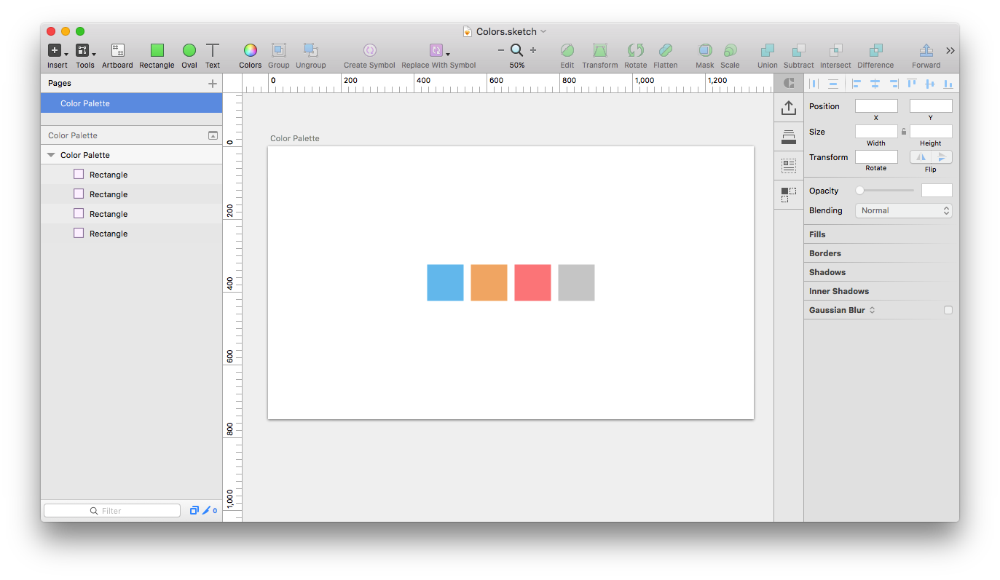

Shared Color Palette for Sketch
==================================

Keep your colors in sync across multiple documents by creating a system of JSON import/export.

[Read about this plugin here](https://medium.com/@marianomike/the-beginners-guide-to-writing-sketch-plugins-part-7-creating-a-shared-color-palette-9c0a1899ee02#.ylmwnj1e9)

## Create a color palette using a Sketch document and Shared Styles:

[Download Sketch Template](https://github.com/marianomike/sketch-sharedcolorpalette/tree/master/Templates)

## From Sketch Color Palette file, export Shared Styles to a JSON file

*`cmd` + `ctrl` + `shift` +* **`9`**

## In new document, import JSON file

*`cmd` + `ctrl` + `shift` +* **`8`**

## Install

Copy **`SharedColorPalette.sketchplugin`** to **Sketch** plugins folder.

## Author

Mike Mariano

Email: mike@uiuxartist.com

Twitter: https://twitter.com/marianomike

http://uiuxartist.com
